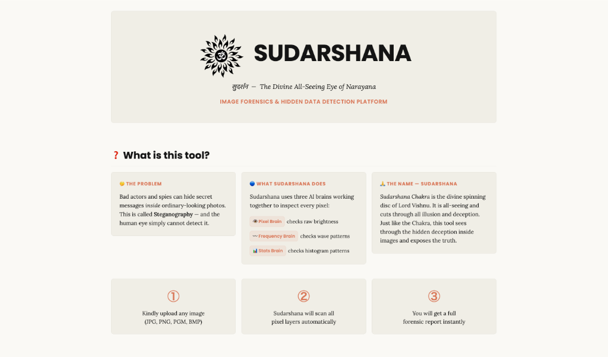
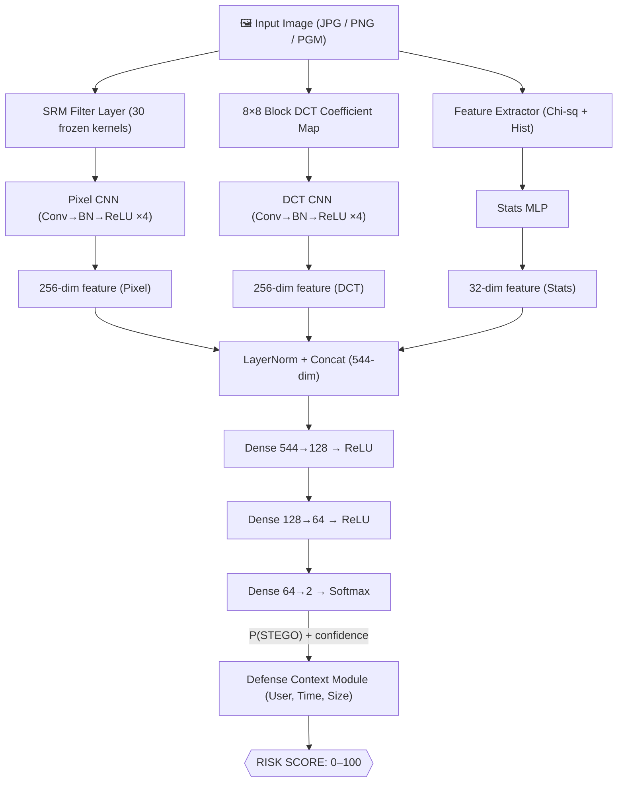

<div align="center">

# 🛡️ Sudarshana — Multi-Branch CNN Steganalysis System

**MBCSS · 2nd Year CSE Research Project · India Provisional Patent Pending**

[](https://python.org)
[](https://pytorch.org)
[](https://streamlit.io)
[](LICENSE)
[](run_all_tests.py)



A multi-branch deep learning system that detects hidden steganographic content in images across three signal domains simultaneously — and provides a defense-context risk score for air-gapped DRDO/defence endpoints.

</div>

---

## 🎯 Problem & Innovation

**The Problem:** Insider threats embed classified data inside images before exfiltrating them. Single-domain detectors (e.g., Xu-Net) miss stego that uses a different technique than the domain they were trained for.

**The Innovation (3 Claims for Patent):**
| Claim | What It Does | Why Novel |
|-------|-------------|-----------|
| **Claim 1** | 3-branch CNN fusion (Pixel + DCT + Statistical) | First system fusing all three domains in a single learnable network |
| **Claim 2** | Defense-context risk scoring (4 metadata factors) | Combines model confidence with user/time/destination context |
| **Claim 3** | INT8-quantized CPU-only deployment pipeline | Sub-100ms inference with no GPU on air-gapped endpoints |

---

## 🧠 Architecture



---

## 📁 Project Structure

```
StegShield/
├── 📂 src/
│   ├── branches/
│   │   ├── branch_a_pixel.py     ← SRM + Pixel CNN  (detects LSB/WOW)
│   │   ├── branch_b_dct.py       ← Block DCT + CNN  (detects J-UNIWARD)
│   │   └── branch_c_stats.py     ← Chi-square MLP   (detects classical stego)
│   ├── model/
│   │   ├── fusion_model.py       ← MultiBranchSteganalyzer (full pipeline)
│   │   └── srm_filters.py        ← 30 Fridrich SRM kernels (frozen)
│   ├── data_pipeline/
│   │   ├── dataset.py            ← PyTorch Dataset + pair-safe split logic
│   │   └── lsb_embedder.py       ← LSB embed/extract/verify CLI
│   ├── training/
│   │   ├── config.py             ← ALL hyperparameters (never hardcode)
│   │   ├── train.py              ← Training loop (branch_a/b/c/fusion/joint)
│   │   └── evaluate.py           ← Metrics, ROC curve, ablation study
│   ├── deploy/
│   │   ├── quantize.py           ← INT8 post-training quantization
│   │   └── risk_scoring.py       ← Defense context risk scorer
│   └── baselines/
│       └── xunet_baseline.py     ← Xu-Net (2016) PyTorch reimplementation
│
├── 📂 app/
│   └── demo.py                   ← Streamlit web demo
│
├── 📂 notebooks/
│   ├── colab_training.py         ← Google Colab training coordinator
│   └── visualize_residuals.py    ← Pixel residual visualization (paper Fig 1)
│
├── 📂 scripts/
│   └── setup_boss_dataset.sh     ← One-command dataset setup
│
├── 📂 data/          ← Gitignored (run setup script to populate)
│   ├── clean/        ← 10,000 BOSSBase images
│   └── stego/        ← 10,000 LSB-embedded stego pairs
│
├── 📂 weights/       ← Gitignored (.pt files from training)
├── 📂 results/       ← Plots, metrics CSVs, history JSONs
├── run_all_tests.py  ← 20-test self-test suite (run before training)
└── requirements.txt
```

---

## 🚀 Quick Start

### Prerequisites
```bash
git clone https://github.com/<your-username>/StegShield.git
cd StegShield
pip install -r requirements.txt
```

### Step 1 — Setup Dataset
```bash
# BOSSBase v1.01 is already downloaded → data/BOSSbase_1.01/
# This copies PGMs to data/clean/ and creates stego pairs:
bash scripts/setup_boss_dataset.sh
```

### Step 2 — Verify Everything Works
```bash
python run_all_tests.py
# Expected: 22/22 tests passed 🎉
```

### Step 3 — Quick Training Test (200 images, 2 epochs, ~2 min on CPU)
```bash
python src/training/train.py --mode branch_a --max_images 200 --epochs 2
```

### Step 4 — Full Training (Google Colab T4 GPU, ~6–8 hours)
```bash
# See notebooks/colab_training.py for step-by-step Colab cells
python notebooks/colab_training.py --mode print_colab_code
```

### Step 5 — Run Demo
```bash
streamlit run app/demo.py
```

---

## 📊 Training Pipeline

Train **in this exact order** (PRD Rule ARCH-03):

```bash
# Phase 1: Pixel branch (SRM + CNN)        — target ≥82% on LSB stego
python src/training/train.py --mode branch_a --epochs 50

# Phase 2: DCT frequency branch            — target ≥76% on DCT stego
python src/training/train.py --mode branch_b --epochs 50

# Phase 3: Statistical branch (MLP)        — target ≥68% (weakest, by design)
python src/training/train.py --mode branch_c --epochs 50

# Phase 4: Fusion (loads pretrained branches, freezes them)
python src/training/train.py --mode fusion --epochs 40

# Phase 5: Full ablation evaluation
python src/training/evaluate.py --ablation

# Phase 6: Xu-Net baseline (comparison table for paper)
python src/baselines/xunet_baseline.py --train --epochs 50

# Phase 7: Quantize for CPU deployment
python src/deploy/quantize.py --model_path weights/fusion_best.pt
```

---

## 📈 Expected Results (Fill in after training)

| Model | Accuracy | Precision | Recall | F1 | AUC | Size | CPU Latency |
|-------|----------|-----------|--------|-----|------|------|------------|
| Xu-Net (Xu 2016) | TBD | TBD | TBD | TBD | TBD | ~8 MB | TBD |
| Yedroudj-Net (2018) | TBD | TBD | TBD | TBD | TBD | ~12 MB | TBD |
| **MBCSS — Branch A only** | TBD | — | — | — | — | — | — |
| **MBCSS — Branch B only** | TBD | — | — | — | — | — | — |
| **MBCSS — Branch C only** | TBD | — | — | — | — | — | — |
| **MBCSS Fusion (ours)** | **TBD** | **TBD** | **TBD** | **TBD** | **TBD** | ~50 MB | TBD |
| **MBCSS INT8 (ours)** | **TBD** | **TBD** | **TBD** | **TBD** | **TBD** | **TBD** | **TBD** |

> ⚠️ **Results are pending full training run. Do NOT cite these numbers until experimentally verified.**
> Replace all TBD entries with actual numbers from `python src/training/evaluate.py --ablation`.

---

## ⚠️ Non-Negotiable Design Rules

```
RULE-ARCH-01  LayerNorm before concat — without this Branch A (256-dim) dominates
              Branch C (32-dim) and the fusion collapses to Branch A only.

RULE-ARCH-02  SRM filters frozen — 30 Fridrich 2012 kernels, requires_grad=False.
              Training through them causes gradient instability.

RULE-ARCH-03  Train branches independently FIRST, then train fusion head only,
              then optionally fine-tune everything jointly at LR=1e-5.

RULE-ARCH-04  Pair-safe splits — clean and stego versions of the same image must
              both be in the SAME split (train or val). Cross-split pairs inflate
              val accuracy by 15–20% (data leakage).

RULE-ARCH-05  Lossless preprocessing ONLY — CenterCrop / RandomCrop, never bilinear
              resize. Bilinear averaging destroys the 1-bit LSB payload.

RULE-ARCH-06  Always save stego as PNG — JPEG re-saves destroy embedded bits.
```

---

## 🎤 30-Second Viva Pitch

> *"Sir, existing steganalysis models like Xu-Net and Yedroudj-Net operate on a
> single signal domain — either pixel residuals or DCT coefficients. Our system,
> MBCSS, uses three parallel branches that simultaneously inspect the pixel domain
> using SRM-filtered residuals, the frequency domain using block-DCT coefficient
> maps, and the statistical domain using chi-square and histogram features. The
> branches are fused via a learned Dense layer with LayerNorm normalisation to
> prevent any one branch from dominating. We add a defense-context scoring module
> that factors in user privilege, transfer time, file size, and destination network
> to produce an actionable 0–100 risk score — not just a binary classification.
> Finally, INT8 post-training quantization reduces model size by 4× and inference
> latency by 3×, enabling deployment on air-gapped CPU-only endpoints like DRDO
> workstations — no GPU required."*

---

## 📖 Dataset

| Property | Value |
|----------|-------|
| Name | BOSSBase v1.01 |
| Images | 10,000 grayscale PGM |
| Resolution | 512 × 512 px |
| Source | http://dde.binghamton.edu/download/ |
| Stego method | LSB with random payload (10% capacity) |
| Split | 70% train / 15% val / 15% test |
| Split type | Pair-safe (see `dataset.py`) |

---

## 📚 References

```
[1] Xu et al., "Structural Design of CNNs for Steganalysis," IEEE SPL, 2016.
    → Our Xu-Net baseline (see src/baselines/xunet_baseline.py)

[2] Yedroudj et al., "Yedroudj-Net: An Efficient CNN for Steganalysis," ICASSP 2018.
    → Our second comparison baseline

[3] Zhang et al., "Depth-wise Separable Convolutions for Steganalysis," 2019.
    → SRNet architecture (see external_repos/)

[4] Fridrich & Kodovsky, "Rich Models for Steganalysis of Digital Images,"
    IEEE TIFS, 2012.
    → Source of 30 SRM filter kernels used in Branch A

[5] Holub & Fridrich, "Designing Steganographic Distortion Using Directional
    Filters," WIFS, 2012.
    → HILL and WOW adaptive stego algorithms (Branch A targets)
```

---

## 🏛️ Patent Information

> ⚠️ **File provisional patent (₹1,750 govt fee) BEFORE any public disclosure.**
>
> Indian patent law requires **absolute novelty** — any public disclosure (GitHub,
> college seminar, report upload, LinkedIn post, or even a public viva) invalidates
> the right to file.
>
> **Claims cover the COMBINATION** of all three innovations — not the individual
> components (which are prior art separately).
>
> Contact your college IP Cell before filing. They may co-own rights if work was
> done using institutional resources.

---

## 🛠️ Tech Stack

| Layer | Technology |
|-------|-----------|
| Deep Learning | PyTorch 2.x + torchvision |
| Signal Processing | scipy (DCT), numpy |
| Evaluation | scikit-learn, seaborn, matplotlib |
| Demo | Streamlit 1.28+ |
| Quantization | `torch.quantization` (INT8, fbgemm) |
| Training | Google Colab T4 GPU (free tier) |
| Deployment Target | CPU-only laptop (air-gapped, no GPU) |
| Dataset | BOSSBase v1.01 (Binghamton University DDE Lab) |

---

## 🧪 Test Suite

```bash
python run_all_tests.py
```

Covers 22 tests across 5 groups:
- **Group 1** — LSB Embedder (basic, edge cases, PNG enforcement, JPEG detection)
- **Group 2** — Dataset split (pair-safety, empty folder guard, transform isolation)
- **Group 3** — PyTorch models (SRM shape, Branch A/B/C forward, Fusion forward+predict)
- **Group 4** — Metric edge cases + chi-square direction verification
- **Group 5** — DCT embedder (basic functionality, oversized payload guard)

---

<div align="center">

**Built in 3 months · 2nd Year CSE · Target: IETE Journal of Research (SCOPUS Q2)**

*If this helped your project, ⭐ the repo and cite our work once published.*

</div>
