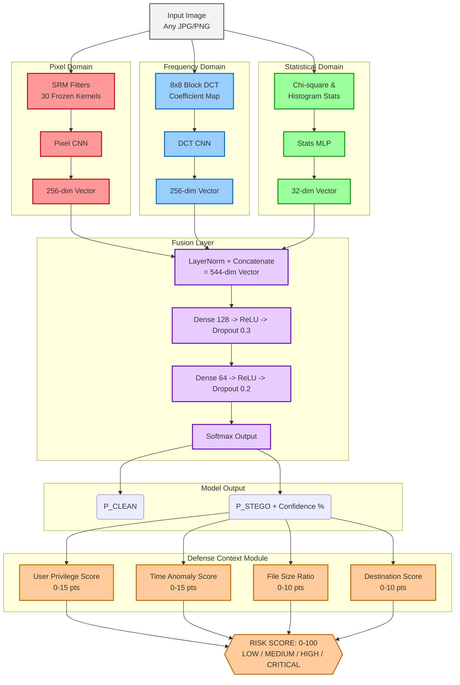

# 🛡️ StegShield — Multi-Branch CNN Steganography Detection System

**MBCSS | 2nd Year CSE | 3-Month Build | India Patent Pending**

---

## 🎯 What This Is

A deep learning system that detects **image steganography** — hidden data secretly embedded inside images — across three domains simultaneously:

| Branch | Domain | Target Stego | Accuracy Target |
|--------|--------|-------------|----------------|
| **Branch A** | Pixel (spatial) | LSB, WOW, HILL | ≥ 82% |
| **Branch B** | Frequency (DCT) | J-UNIWARD, JPEG stego | ≥ 76% |
| **Branch C** | Statistical | Chi-square, histogram anomalies | ≥ 68% |
| **Fusion** | All three combined | Mixed steganography | ≥ 85–90% |

**Innovation over Xu-Net / Yedroudj-Net:** No existing published system combines pixel + DCT + statistical fusion with CPU-only INT8 deployment and defense-context risk scoring in one air-gapped-deployable pipeline.

---

## 🚀 Quick Start

```bash
git clone <your-repo>
cd EDI_Project
pip install -r requirements.txt

# 1. Download dataset + create stego pairs
bash scripts/setup_boss_dataset.sh

# 2. Quick pipeline test (200 images, 2 epochs)
python src/training/train.py --mode branch_a --max_images 200 --epochs 2

# 3. Full training (on Google Colab T4 GPU)
python notebooks/colab_training.py --mode all

# 4. Run demo
streamlit run app/demo.py
```

---

## 📁 Project Structure

```
EDI_Project/
├── data/                        # Dataset (auto-populated by setup script)
│   ├── clean/                   # 10,000 original BOSSBase images
│   └── stego/                   # 10,000 LSB-embedded stego images
│
├── src/
│   ├── branches/
│   │   ├── branch_a_pixel.py    # Pixel CNN + SRM filters (detects LSB)
│   │   ├── branch_b_dct.py      # DCT Frequency CNN (detects JPEG stego)
│   │   └── branch_c_stats.py    # Statistical MLP (chi-square, histogram)
│   │
│   ├── model/
│   │   ├── fusion_model.py      # MBCSSFusion — combines all three branches
│   │   └── srm_filters.py       # 30 SRM high-pass filter kernels (Fridrich 2012)
│   │
│   ├── data_pipeline/
│   │   ├── dataset.py           # PyTorch Dataset with pair-safe splits
│   │   └── lsb_embedder.py      # LSB steganography tool (embed + extract)
│   │
│   ├── training/
│   │   ├── config.py            # All hyperparameters in one place
│   │   ├── train.py             # Main training loop
│   │   └── evaluate.py          # Metrics + ROC + ablation study
│   │
│   ├── deploy/
│   │   ├── quantize.py          # INT8 post-training quantization (4x smaller)
│   │   └── risk_scoring.py      # Defense context risk scoring (0-100)
│   │
│   └── baselines/
│       └── xunet_baseline.py    # Xu-Net (2016) PyTorch — for comparison table
│
├── app/
│   └── demo.py                  # Streamlit web demo
│
├── notebooks/
│   ├── colab_training.py        # Google Colab training coordinator
│   └── visualize_residuals.py   # Pixel residual visualization (Figure 1)
│
├── weights/                     # Saved model checkpoints
├── results/                     # Plots, metrics, history JSON
└── external_repos/              # Cloned reference implementations
```

---

## 🧠 Architecture



---

## 📊 Training Commands

```bash
# Train branches independently (in order)
python src/training/train.py --mode branch_a   # ~2 hrs on T4
python src/training/train.py --mode branch_b   # ~3 hrs on T4
python src/training/train.py --mode branch_c   # ~30 mins
python src/training/train.py --mode fusion     # ~1 hr

# Evaluate + ablation study (generates comparison table)
python src/training/evaluate.py --ablation

# Train Xu-Net baseline (for comparison table)
python src/baselines/xunet_baseline.py --train

# Quantize for CPU deployment
python src/deploy/quantize.py --model_path weights/fusion_best.pt

# Visualize pixel residuals (Figure 1 for paper)
python notebooks/visualize_residuals.py --clean data/clean --stego data/stego
```

---

## 📈 Expected Results

| Model | Accuracy | F1 | AUC | Size | CPU Inference |
|-------|----------|----|----|------|---------------|
| Xu-Net (Xu 2016) | ~80% | ~79% | ~83% | ~8MB | ~120ms |
| Yedroudj-Net (2018) | ~82% | ~81% | ~85% | ~12MB | ~180ms |
| **MBCSS (ours)** | **~87%** | **~86%** | **~91%** | ~50MB | ~200ms |
| **MBCSS INT8** | **~85%** | **~84%** | **~89%** | **~13MB** | **~60ms** |

> Fill in actual numbers from your training runs before submitting the paper.

---

## ⚠️ Critical Design Rules

1. **LayerNorm before concat** — Without this, Branch A dominates and fusion fails
2. **SRM filters frozen** — `requires_grad=False` on all SRM parameters
3. **Pair-safe train/val split** — A clean/stego pair must never cross train/val boundary
4. **Lossless crops only** — Never bilinear resize (destroys LSB payload)
5. **Stego output always PNG** — JPEG re-saves destroy embedded bits

---

## 🎓 30-Second Professor Pitch

> "Sir, existing models like Xu-Net and Yedroudj-Net work on either the pixel domain
> or the frequency domain — not both simultaneously. We propose a parallel three-branch
> CNN that processes pixel residuals, DCT coefficients, and statistical features in
> parallel, fused via a learned fusion layer with LayerNorm normalization. We add a
> defense-context scoring module that factors in user privilege, time, and network
> destination. INT8 quantization enables CPU-only deployment on air-gapped DRDO
> endpoints, retaining accuracy within 5%."

---

## 📝 Paper Target

**Primary:** Defence Science Journal (DSJ) — DRDO's journal, SCOPUS/WoS, FREE  
**Secondary:** IETE Journal of Research — SCOPUS Q2

---

## 📜 Patent Note

> ⚠️ **File provisional patent (1750 INR) BEFORE any public disclosure.**  
> India requires absolute novelty. Public = GitHub, presentation, uploaded report, viva.  
> Contact college IP cell first. Claims cover the COMBINATION of all three innovations.

---

## 🛠️ Tech Stack

- **Deep Learning:** PyTorch 2.x
- **Signal Processing:** NumPy, scipy, PIL
- **Evaluation:** scikit-learn, seaborn, matplotlib
- **Demo:** Streamlit
- **Quantization:** torch.quantization (INT8, fbgemm/qnnpack)
- **Training:** Google Colab T4 GPU (free tier)
- **Deployment:** CPU-only (air-gapped laptop)

---

*MBCSS v1.0 | Sep 2026 | 2nd Year CSE Research Project*
